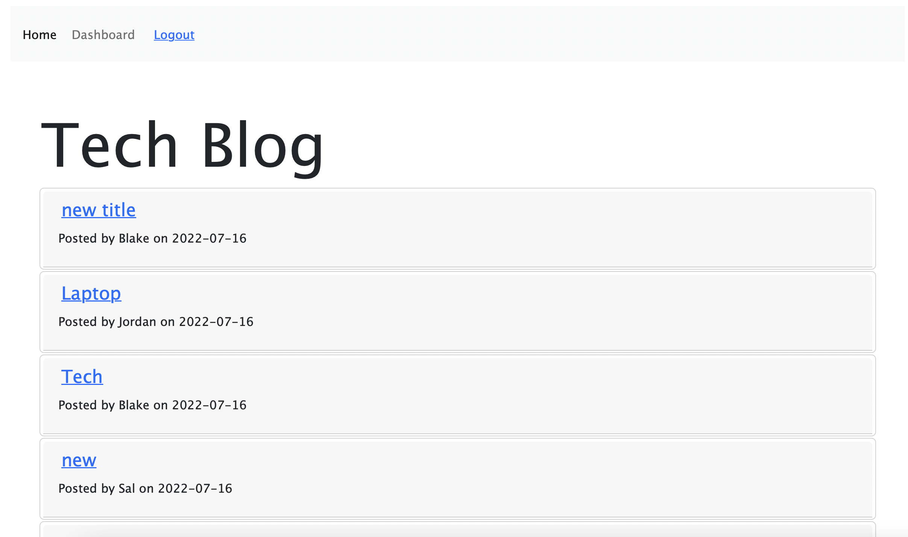

# TechBlog

## Description 
The applicaiton is a CMS-style blog that allows users to publish posts and interact with other users posts. It uses sequelize to connect a MySQL database. Once logged in a user is able to create new posts, update their posts, and view and add comments on other users posts. 


## Usage

Clone the repo, navigate to the root folder, and run the following commands to start the application

Seed DB:
```npm run seed```

Start the server:
```node server.js```

## Technologies Used
- Handlebars
- Javascript
- CSS
- Node.js
- Sequelize
- Express

## Applicaiton Repository
https://github.com/mayalorimer/TechBlog

## Application Deployment
https://sleepy-plateau-01947.herokuapp.com

## Application Screenshot



## License
MIT License

Permission is hereby granted, free of charge, to any person obtaining a copy of this software and associated documentation files (the "Software"), to deal in the Software without restriction, including without limitation the rights to use, copy, modify, merge, publish, distribute, sublicense, and/or sell copies of the Software, and to permit persons to whom the Software is furnished to do so, subject to the following conditions:

The above copyright notice and this permission notice shall be included in all copies or substantial portions of the Software.

THE SOFTWARE IS PROVIDED "AS IS", WITHOUT WARRANTY OF ANY KIND, EXPRESS OR IMPLIED, INCLUDING BUT NOT LIMITED TO THE WARRANTIES OF MERCHANTABILITY, FITNESS FOR A PARTICULAR PURPOSE AND NONINFRINGEMENT. IN NO EVENT SHALL THE AUTHORS OR COPYRIGHT HOLDERS BE LIABLE FOR ANY CLAIM, DAMAGES OR OTHER LIABILITY, WHETHER IN AN ACTION OF CONTRACT, TORT OR OTHERWISE, ARISING FROM, OUT OF OR IN CONNECTION WITH THE SOFTWARE OR THE USE OR OTHER DEALINGS IN THE SOFTWARE.

